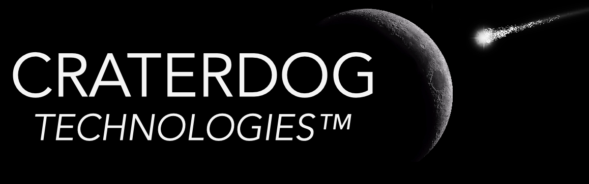

## The Bali Nebula™ Example Code (v2)

### Overview
This project contains the example code found in the [Bali Nebula™](https://github.com/craterdog-bali)
related projects. It is used to test the example code prior to posting it to the various wiki
pages. This project can be ignored by general users.

### Contributing
Project contributors are always welcome. Create a
[fork](https://github.com/craterdog-bali/js-bali-example-code) of the project and add cool
new things to the project. When you are ready to contribute the changes create a subsequent
["pull request"](https://help.github.com/articles/about-pull-requests/). Any questions and
comments can be sent to [craterdog@gmail.com](mailto:craterdog@gmail.com).
